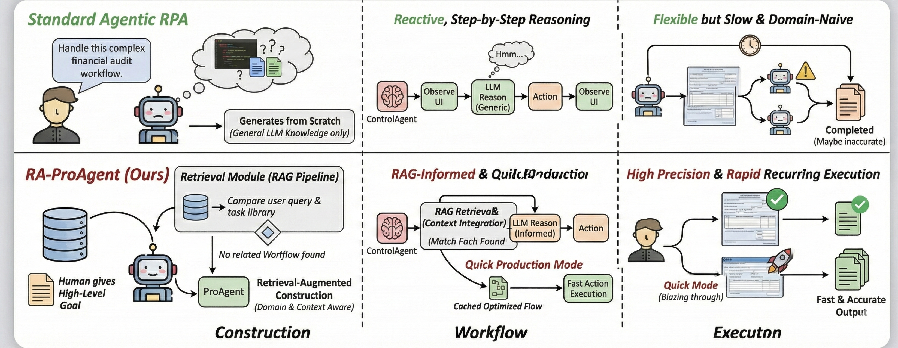
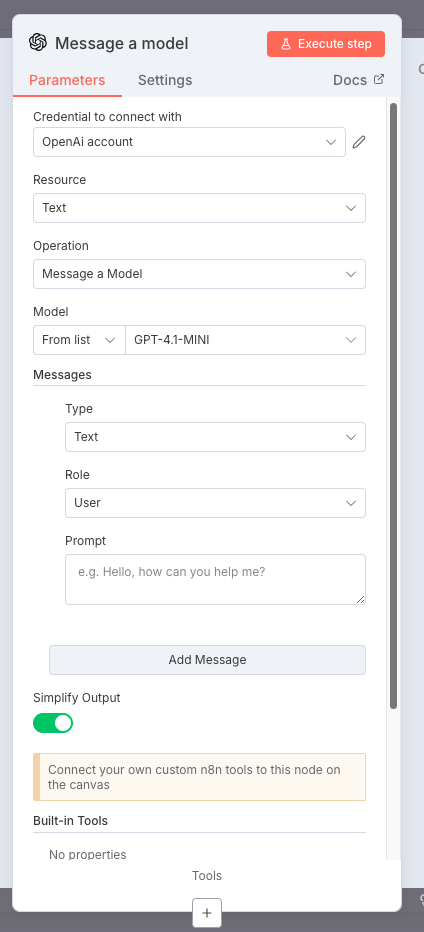
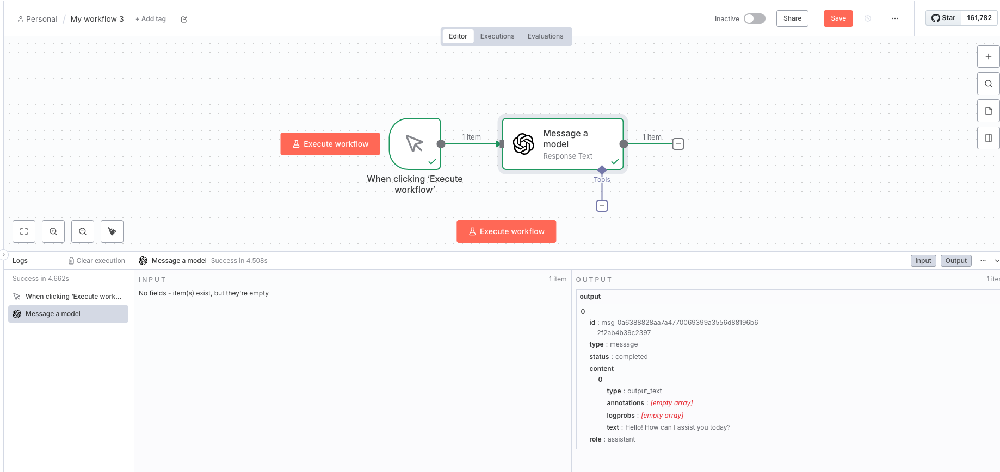

# RA-ProAgent: ProAgent with RAG

Acknowledgement: This project is built based on ProAgent.

## ProAgent: From Robotic Process Automation to Agentic Process Automation


From water wheels to Robotic Process Automation (RPA), automation technology has evolved throughout history to liberate human beings from arduous tasks. Yet, RPA struggles with tasks needing human-like intelligence, especially in elaborate design of workflow construction and dynamic decision-making in workflow execution. As Large Language Models (LLMs) have emerged human-like intelligence, this paper introduces `Agentic Process Automation`(APA), a groundbreaking automation paradigm using LLM-based agents for advanced automation by offloading the human labor to agents associated with construction and execution. We then instantiate `ProAgent`, an LLM-based agent designed to craft workflows from human instructions and make intricate decisions by coordinating specialized agents. Empirical experiments are conducted to detail its construction and execution procedure of workflow, showcasing the feasibility of APA, unveiling the possibility of a new paradigm of automation driven by agents

## 

Referenced code base paper `Agentic Process Automation`[here](https://arxiv.org/abs/2311.10751).

## Implementation
Based on ProAgent, we extend it with RAG ability by

1. Setting up query and workflows library
2. Adding retrieval procedure before workflow construction
3. Enabling retrieval augmented workflow construction ability with Refine_oneshot mode



## Code Setup

### 1. Install packages

```Shell
pip install -r requirements.txt
```

especially, We use the OpenAI gpt-4.1-mini

### 2. Prepare for  n8n

Our projects use a self-host n8n, please prepare a n8n environment first.

#### install n8n

Our projects use a self-host n8n, you must first install a n8n following the [guide](https://docs.n8n.io/hosting/installation/npm/) . You can use this command in linux/macOS

```bash
npm install n8n -g
```

We build and test RA-ProAgent with n8n version: 1.120.4, 1.122.4


#### Connect your account in n8n


You need to register or connect an existing APP with n8n **before** launching `RA-ProAgent`. Connecting an APP may have some APP-specific operations, you can follow the n8n credential guide [here](https://docs.n8n.io/integrations/builtin/credentials/)

Let's create a simple openai workflow first.

1. create a credential
    1. lick create credential: search for openai
    2. paste your openai key to the API Key field
    3. save
2. create a workflow
    1. add a trigger manually node
    2. click the add button on the right of the trigger node
    3. search for openai, add a `Message a model` node
    4. Credential to connect with: OpenAi account
    5. Model: GPT-4.1-MINI
    
    
    
    6. save the workflow

#### Save credentials

Our code base needs to load the workflow ID and credential ID. So you must make some workflow and register some apps before, then do the following commands to decode the credentials from n8n service

```Shell
n8n export:credentials --all --decrypted --output=./ProAgent/n8n_tester/credentials/c.json
```

move `c.json` to `./ProAgent/n8n_tester/credentials/c.json`

```Shell
n8n export:workflow --all --output=./ProAgent/n8n_tester/credentials/w.json
```

move `w.json` to `./ProAgent/n8n_tester/credentials/w.json`

You should find your openai key and a workflow you just created.

## Code Running

The running depends on the configuration set in `ProAgent/config.py`, you can change the running mode:

- **development**: This is the mode to construct a new workflow
- refine: load from an existing workflow, and then refine the workflow with some new request
- **production**: load from an existing workflow, you can use this mode to re-produce an existing run of `ProAgent`
- **Production_quick**: load from an existing workflow without calling agent and parsing agent's choice, you can use this mode to reproduce all workflows in the folder `./apa_case_storage/`
- **Refine_oneshot**: Build a workflow for the new query based on a existing workflow, you can choose any base workflows (those without ancestor.json) in the folder `./apa_case_storage/`
- **RARefine**: Build a workflow based on the most similar retrieved query and workflow.


we have provided complete-built workflows in `./apa_case_storage`, you can use `Production_quick` mode to load and run directly.

> To reproduce complete-built workflows, please first refer to `./setup_resources_n8n.md`, and setup n8n credentials, and resources used in the complete-built worflows.

> we disable the test-on-change feature in production, Production_quick mode, And the APA-code will be test only once in the end of the run
>
> In the opposite, the development, refine, Refine_oneshot, and RARefine mode enable test-on-change feature

use the following command to start `RA-ProAgent`

```python
python main.py
```

> Note that we have wrote a readable record system. All of the `RA-ProAgent` runs will generate a new record in `./records/`

If you use the development mode, you must prepare OpenAI key first. 
Following `.env.example`, you can set up the API ke like:

```
OPENAI_API_KEY=
OPENAI_API_BASE=
```

You can also add other environment variables you want, such as email, google sheet link so that you can easily use it when constructing queries.

- OpenAI: `RA-ProAgent` is based on `GPT 4.1 mini`.


## Citation

If you find this repo helpful, feel free to cite the original paper.

```
@article{ye2023proagent,
  title={ProAgent: From Robotic Process Automation to Agentic Process Automation},
  author={Ye, Yining and Cong, Xin and Tian, Shizuo and Cao, Jiannan and Wang, Hao and Qin, Yujia and Lu, Yaxi and Yu, Heyang and Wang, Huadong and Lin, Yankai and others},
  journal={arXiv preprint arXiv:2311.10751},
  year={2023}
}
```

If you find RAG part of this repo helpful, feel free to cite the github repo directly.
